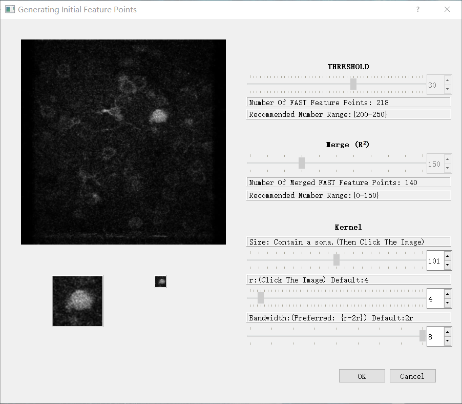
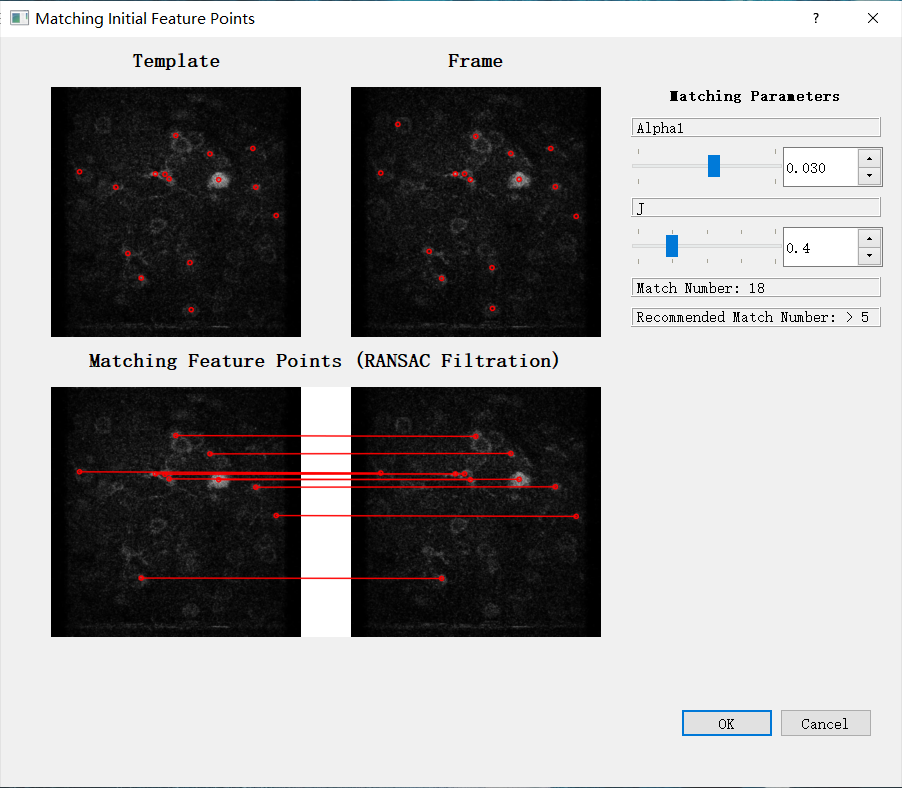
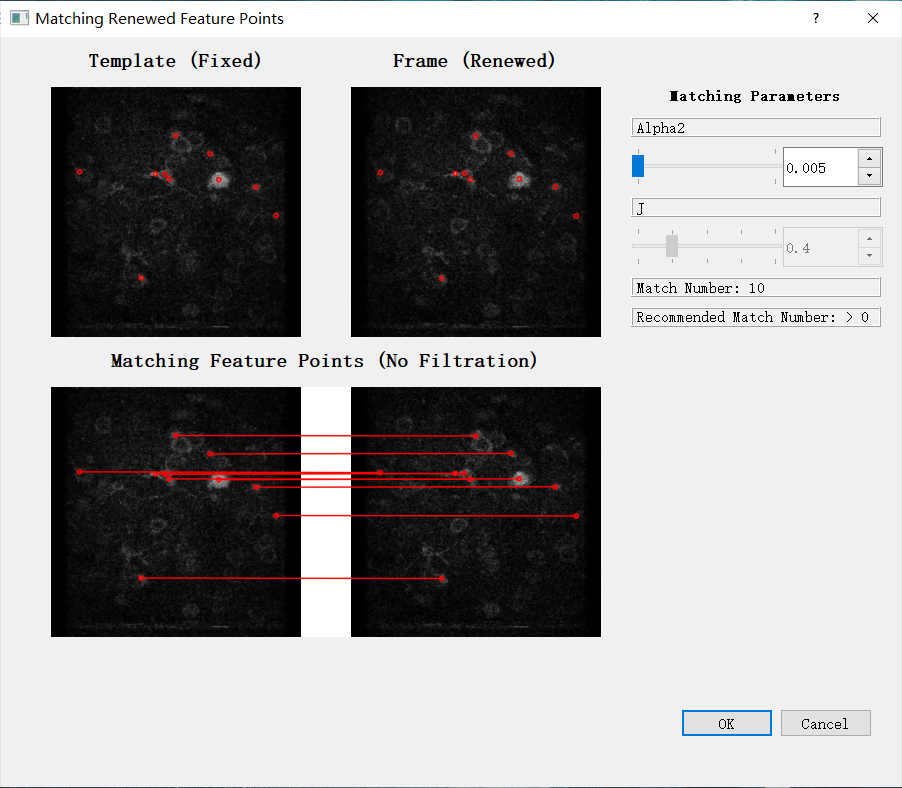
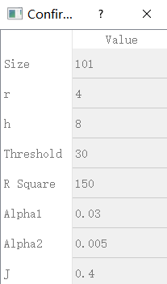

# FIFER
A **F**ast **I**mage **F**eature **E**xtraction and **R**egistration (**FIFER**) method for motion correction of two-photon Ca2+ imaging data.
FIFER is a GUI software which can adapt parameter for each data. (Notice: This software can only run on Windows.)

## Eviroment Dependence
### 1. Parameter Configure GUI:
#### 1) Base: *Python 3.x;*
#### 2) Python Package: *PyQt5; pyqt5-tools; numpy; opencv-python;*

### 2. Core Encapsulated C++ Algorithm:
#### 1) Base: *TDM-GCC 5.1.0-2*
#### 2) C++ Package: *OpenCV 4.5.0; Eigen3;*

## Enviroment Deployment
### *Parameter Configure GUI (Contain Core Encapsulated C++ Algorithm):*
#### 1) Install Python3.x from https://www.python.org/
#### 2) pip install PyQt5
#### 3) pip install pyqt5-tools
#### 4) pip install numpy
#### 5) pip install opencv-python
#### 6) run main.py

## An example and Recommended Parameters of Test Data
### 1. Example

### 2. Recommended Parameters

## Index（目录结构）
#### └── FIFER GUI
####        ├── Core
####        │     ├── Normal.exe
####        │     └── DownScale.exe
####        ├── UI
####        │     ├── MainWidget.py
####        │     ├── Mode.py
####        │     ├── Parameter.py
####        │     ├── Parameter1.py
####        │     └── Parameter2.py
####        ├── Test Data
####        │     ├── template.png
####        │     └── source.avi
####        ├── Main.py
####        └── Parameter.txt

## If you have any question, please contact weiyi_liu1@outlook.com
